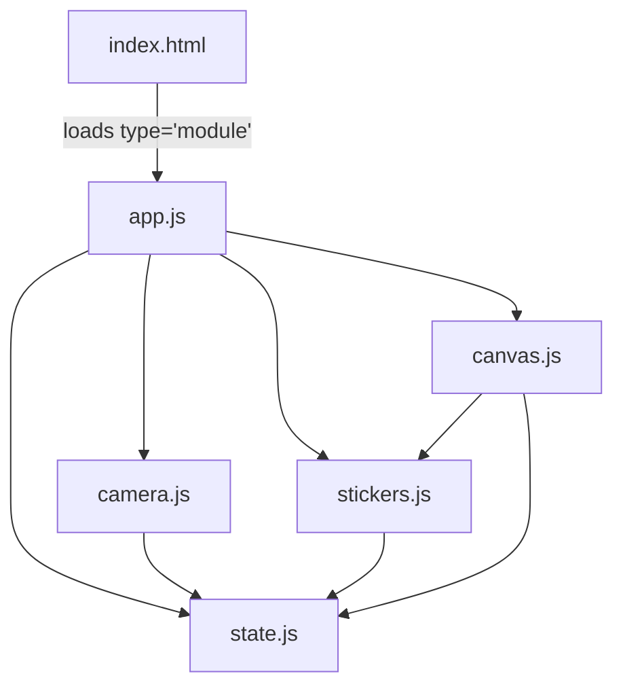

# 💿 Y2K 4cut Camera - Y2K Photo Booth 🐰

90년대 빈티지 레트로 감성을 담은 **미니멀 Y2K 테마 인생네컷 포토부스 웹 애플리케이션**입니다.  
다양한 레트로 프레임 테마, 대화형 CD 플레이어 위젯, 스티커 인형놀이 및 고해상도 캔버스 합성 엔진을 빌드 도구 없이 웹 표준 기술(HTML, CSS, Vanilla JS)만으로 구현하였습니다.

---

## 🎨 주요 특징 및 구현 기술

### 1. 렉 없는 고속 카메라 전환 (Warm-Stream 재사용)
* **카메라 프리뷰 대기 시간 제로**: 최초 1회 카메라 접근 권한을 획득하면 스트림을 백그라운드에 상온 유지(Warm)하여, 슬롯을 전환할 때마다 발생하는 카메라 버퍼링 및 하드웨어 켜짐 딜레이를 완벽히 제거하였습니다.
* **즉각적인 촬영 시퀀스**: 촬영할 슬롯을 터치/클릭하는 순간 카메라 스트림 주소만 덮어씌워 켜진 후 즉시 3초 카운트다운에 돌입합니다.

### 2. 소리나라 MP3 (Soribada Player) 테마
* **실시간 비주얼라이저**: 복고풍 소리바다 뮤직 플레이어 UI를 모티브로 한 스킨을 제공합니다.
* **캔버스 벡터 드로잉**: Brushed Metal 질감의 바디, 광택이 흐르는 조작 버튼, 타임 코드(00:28.23) 및 트랙 메타데이터 표시 패널, 그리고 백그라운드에 흐르는 비주얼 파형까지 전부 고해상도 캔버스 API로 100% 벡터 렌더링을 구현하였습니다.

### 3. 클라이언트 사이드 스티커 샌드박스
* **멀티 터치 및 제스처 지원**: 이모지, 텍스트 말풍선, 이미지 스티커를 무제한 배치 가능합니다.
* **동작 제어**: 드래그앤드롭(Drag & Drop) 이동은 물론, 회전·크기 조절 핸들(`⤗`) 인터랙션을 지원하며 모바일 TouchEvent와 데스크톱 MouseEvent를 동시 처리합니다.
* **텍스트 커스텀**: 말풍선 스티커 추가 기능을 제공하며, 그림자 오프셋이 적용된 레트로 스타일 박스로 렌더링됩니다.

### 4. 고해상도 합성 다운로드 엔진 (`1200x2800px`)
* **로고 없는 깔끔한 저장**: 출력용 고해상도 이미지 생성 시 `4cutcamera` 등의 워터마크 로고가 노출되지 않도록 처리하여 순수하고 예쁜 추억을 저장할 수 있습니다.
* **1:1 비율 합성**: 화면의 스티커 상대 위치, 스케일 비율, 회전 각도(radian)를 수학적으로 계산해 고화질 도화지 위에 정확하게 매핑합니다.

---

## 📁 프로젝트 파일 구조 (ES6 모듈화)

기존의 1,600줄에 달하던 `app.js` 단일 코드를 유지보수와 협업을 극대화할 수 있도록 **브라우저 네이티브 ES6 모듈(`<script type="module">`)** 기반으로 분리 및 리팩토링하였습니다.

```
anniversary-frame/
├── index.html          # HTML 구조 및 테마별 돔 레이아웃 정의
├── style.css           # Windows 95, 소리바다, Y2K 글라스모피즘 스타일 시트
├── state.js            # 전역 애플리케이션 상태 (state, themeTitles) 관리
├── camera.js           # 미디어 캡처, 권한 획득, 카운트다운, 슬롯 선택 관리
├── stickers.js         # 스티커 생성, 삭제, 이동/회전/크기조절 인터랙션 관리
├── canvas.js           # 고해상도 프레임 드로잉 및 최종 이미지 저장 합성 엔진
├── app.js              # 메인 진입점. DOM 바인딩 및 이벤트 오케스트레이션
└── fonts/              # 레트로 테마용 폰트 파일
```

### 🧬 모듈 아키텍처 다이어그램



---

## 🚀 로컬 실행 방법

이 프로젝트는 Vite나 Webpack 같은 별도의 복잡한 번들러 환경 구축 없이, 브라우저가 지원하는 정적 모듈 로더를 사용합니다. 보안 문제(CORS)로 인해 로컬에서 단순히 `index.html`을 열지 않고 **로컬 서버**를 실행해야 정상 작동합니다.

### 1. HTTP-Server 활용 방법
```bash
# http-server 전역 설치 없이 npx로 구동
npx http-server -p 8000
```
웹 브라우저를 열고 `http://localhost:8000`으로 접속하면 즉시 포토부스를 이용할 수 있습니다.

### 2. Python SimpleHTTPServer 활용 방법
```bash
# Python 3 버전
python -m http.server 8000
```

---

## 📸 주요 기능 시나리오
1. **슬롯 선택**: 원하는 컷(1~4번)의 슬롯을 누릅니다.
2. **카메라 권한 획득 및 시작**: 카메라 모드일 경우 즉시 권한을 묻고, 수락하는 즉시 카운트다운(3초) 후 스냅샷이 촬영됩니다.
3. **재촬영**: 마음에 들지 않는 사진은 슬롯 우측 상단의 `🔄` 버튼을 누르면 해당 슬롯만 리셋되어 언제든 다시 찍을 수 있습니다.
4. **꾸미기**: 테마 스크롤바에서 원하는 스킨(사이버 크롬, 소리나라 MP3 등)을 선택하고 귀여운 레트로 스티커를 배치하여 꾸밉니다.
5. **다운로드**: 우하단의 `사진 다운로드`를 누르면 프레임 테마별 고품질 합성 결과물이 다운로드됩니다.
